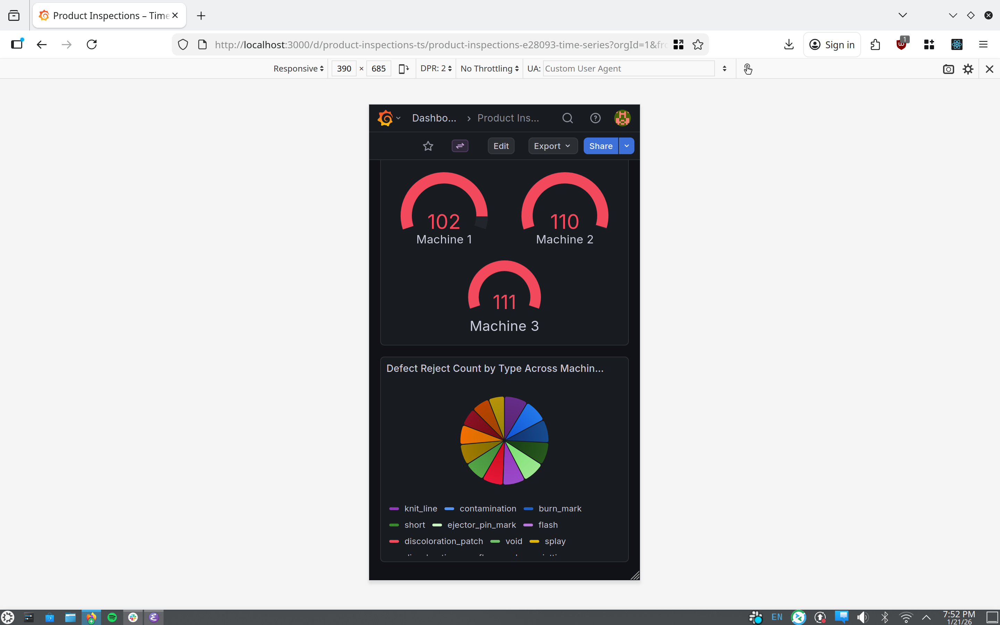
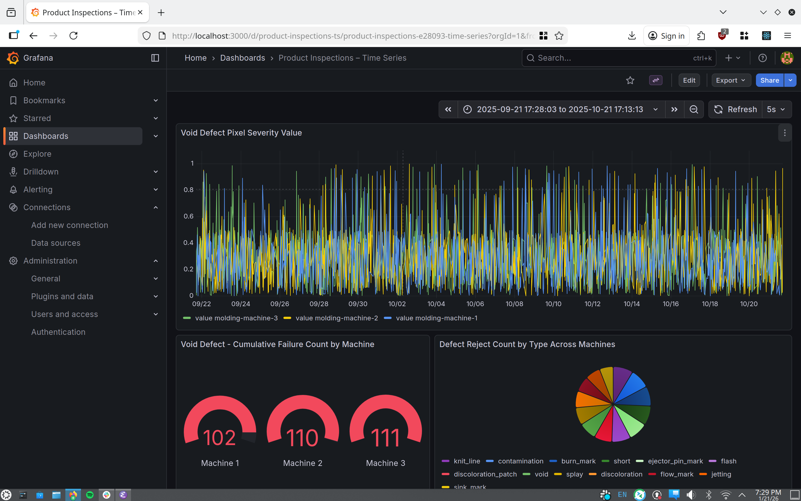

# About

This is a data visualization app for time-series data.

# Functional Requirements

- **Data Ingestion Script:** done in a one-off microservice Python
  SQLAlchemy container. Fetches from an input URL configured in
  [.env](.env).
- **Customizable Visualizations:** Grafana dashboards can be
  customized by the user. We have columns in the database for nearly
  every attribute of the json, i.e. flattened info for each defect
  test as well as molding machine state info. The user can make
  advanced visualizations with any of these in Grafana.
- **Visualize multiple aspects of dataset:** we visualize timeseries
  data as well as cumulative data for defect rejects.

# Features

1. **Containerized:** the app uses `docker compose` for everything.
2. **Frontend/Backend different Language:** this app uses React for
   the frontend and Golang for the backend implicitly because we use
   the Grafana container image.
3. **Mobile Client Compatibility:** this app renders fine for mobile
   clients as depicted in the following image: 
4. **Database:** there's a PostgreSQL container to store the dataset.
5. **More than one visualization:** There are 3 default visualizations
   configured in
   [grafana/dashboards/default.json](grafana/dashboards/default.json).
   
   
# How to Run

Run the following command to build/fetch the containers, start the
postgres container, run the ingestion script, and start grafana:

```
docker compose up
```

Then open http://localhost:3000 and log in as user `admin` with
password `admin` (skip the update password step). Next, navigate to
**Dashboards** in the left nav panel, and click on **Product
Inspections - Time Series**, which should pull up a view similar to
the image below after you click *"zoom to data"* on the timeseries
graph. You can zoom on the figures and edit their queries to
materialize new views of the data.



To change the dataset we use, change the `DATASET_URL` in [.env](.env)
then remove the postgres volume for a fresh start:

```
docker compose down -v
docker compose up
```

# Simplicity

The core code/configuration of this project is 241 LOC (excluding the
Markdown and default grafana dashboard JSON). Below is some info on that.

```
ross@x1-ubuntu:~/personal/fullstack-json-vis$ tree
.
├── docker-compose.yml
├── grafana
│   ├── dashboards
│   │   └── default.json
│   └── provisioning
│       ├── dashboards
│       │   └── dashboard.yml
│       └── datasources
│           └── datasource.yml
├── images
│   ├── figures.png
│   └── mobile.png
├── README.md
└── scripts
    ├── Dockerfile
    ├── ingest_data.py
    └── requirements.txt

8 directories, 10 files
```

```
ross@x1-ubuntu:~/personal/fullstack-json-vis$ cloc .
-------------------------------------------------------------------------------
Language                     files          blank        comment           code
-------------------------------------------------------------------------------
JSON                             1              0              0            409
Python                           1             22              8            163
Markdown                         1             18              0             84
YAML                             3              2              0             68
Text                             1              0              0              6
Dockerfile                       1              3              1              4
-------------------------------------------------------------------------------
SUM:                             8             45              9            734
-------------------------------------------------------------------------------
```
